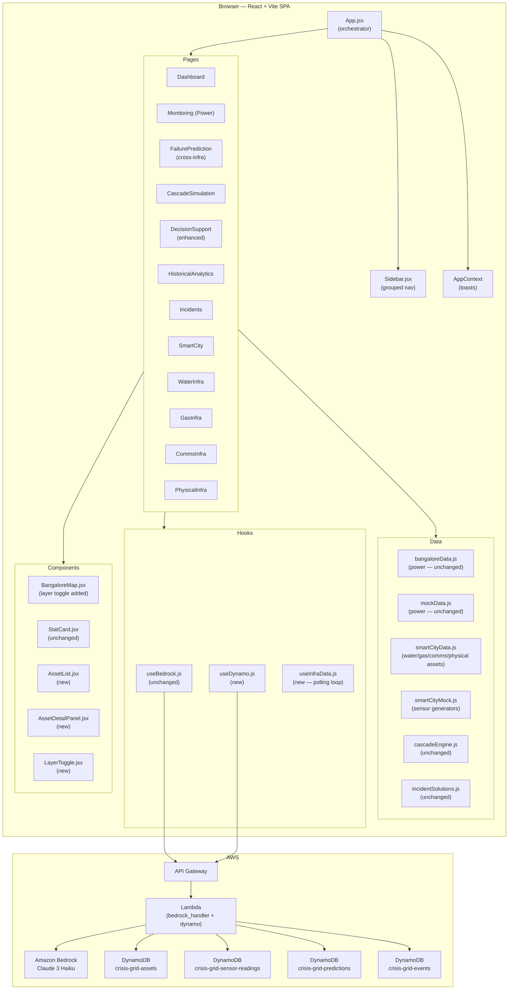

# Design Document

## Overview

The Crisis Grid Smart City extension transforms the existing BESCOM Power Monitoring Dashboard (React + Vite) into a **Multi-Infrastructure Smart City Monitoring Platform** for Bangalore. The existing power monitoring stack — substations, live sensor simulation, cascade simulation, AI decision support via Amazon Bedrock — is preserved without modification. Four new infrastructure domains are added: Water, Gas/LPG, Communications, and Physical (structural). All five domains share a unified asset data model, a common map layer system, a cross-infrastructure failure prediction module, and an enhanced AI Decision Support page.

The platform is a single-page React application. All sensor data is simulated client-side. AWS DynamoDB is used for persistence via the existing Lambda proxy. The design system (CSS variables, card styles, badge styles, animations) is unchanged.

---

## Architecture



### Key Architectural Decisions

**No new routing library.** The existing page-key pattern in `App.jsx` (`pages[page]`) is extended with new keys (`water`, `gas`, `comms`, `physical`). This avoids introducing React Router and keeps the diff minimal.

**Shared asset data module.** All non-power infrastructure static data (asset definitions, coordinates, zone assignments) lives in `smartCityData.js`. Sensor generators live in `smartCityMock.js`. This mirrors the existing `bangaloreData.js` / `mockData.js` split.

**`useInfraData` hook.** A single custom hook manages the polling loop for all four new infrastructure types, returning a `Map<assetId, SensorReading>`. This keeps `App.jsx` clean and avoids duplicating the `setInterval` pattern four times.

**`useDynamo` hook.** A thin wrapper around `fetch` to the existing Lambda proxy endpoint, adding DynamoDB write operations. Falls back silently on error (requirement 9.5).

**BangaloreMap extended, not replaced.** The existing component receives an optional `layers` prop (a `Map<infraType, Asset[]>`) and an `activeLayers` set. When these props are absent the component behaves exactly as before, preserving all existing power behaviour.

---

## Components and Interfaces

### New Pages

#### `WaterInfra.jsx`
Props: `{ infraData: Map<assetId, SensorReading> }`
- Renders Top_Metrics row (StatCard ×4)
- Embeds BangaloreMap with Water layer active
- Renders AssetList filtered to `infraType === "water"`
- On asset select → renders AssetDetailPanel

#### `GasInfra.jsx`
Props: `{ infraData: Map<assetId, SensorReading> }`
- Same structure as WaterInfra, Gas-specific fields

#### `CommsInfra.jsx`
Props: `{ infraData: Map<assetId, SensorReading> }`
- Same structure, Communications-specific fields

#### `PhysicalInfra.jsx`
Props: `{ infraData: Map<assetId, SensorReading> }`
- Same structure, Physical-specific fields. 30-second polling interval.

### New Shared Components

#### `AssetList.jsx`
```
Props: {
  assets: Asset[],
  readings: Map<assetId, SensorReading>,
  onSelect: (asset: Asset) => void,
  selectedId: string | null,
  infraType: InfraType,
}
```
Renders a scrollable table. Each row shows: asset name, zone, type, key metric, status badge. Highlights rows with warning/critical conditions per infrastructure-type thresholds.

#### `AssetDetailPanel.jsx`
```
Props: {
  asset: Asset | null,
  reading: SensorReading | null,
  infraType: InfraType,
  onClose: () => void,
}
```
Slide-in panel. Renders all sensor fields for the given `infraType`. Uses a field-config lookup table to avoid per-type branching in JSX.

#### `LayerToggle.jsx`
```
Props: {
  activeLayers: Set<InfraType>,
  onToggle: (infraType: InfraType) => void,
  compact?: boolean,   // true when viewport < 768px
}
```
Renders one button per InfraType. Positioned absolutely over the map (z-index 1000). Collapses to icon-only row when `compact` is true.

### Modified Components

#### `BangaloreMap.jsx` (extended)
New optional props:
```
layers?: Map<InfraType, Asset[]>
activeLayers?: Set<InfraType>
layerReadings?: Map<assetId, SensorReading>
```
When `layers` is provided, renders additional CircleMarker groups per active layer. Existing power rendering is gated on `activeLayers.has("power")` defaulting to `true` when prop is absent.

#### `Sidebar.jsx` (extended)
The flat `NAV` array is replaced with a structure that supports a collapsible group:
```js
const NAV_GROUPS = [
  { type: "item", id: "dashboard", ... },
  {
    type: "group",
    id: "infrastructure",
    label: "Infrastructure",
    defaultOpen: true,
    items: [
      { id: "monitoring", label: "Power", ... },
      { id: "water",      label: "Water", ... },
      { id: "gas",        label: "Gas", ... },
      { id: "comms",      label: "Communications", ... },
      { id: "physical",   label: "Physical", ... },
    ]
  },
  { type: "item", id: "prediction", ... },
  ...
]
```

### New Hooks

#### `useInfraData(assets, intervalMs)`
```
Input:  Asset[], number
Output: { readings: Map<assetId, SensorReading>, activeEvents: ActiveEvent[] }
```
Runs `setInterval` at `intervalMs`. On each tick, calls the appropriate generator for each asset's `infraType`, updates readings state, derives `activeEvents` from threshold checks.

#### `useDynamo()`
```
Output: { writeReading, writeAsset, writePrediction, writeEvent }
```
Each write function calls `fetch(API_URL, { method: "POST", body: { action, payload } })`. On error, logs to console and resolves without throwing.

---

## Data Models

### Base Asset Schema
```ts
interface Asset {
  assetId:     string;          // unique across all infraTypes, e.g. "WAT_PUMP_WHITEFIELD_01"
  name:        string;          // "Whitefield Pump Station 1"
  shortName:   string;          // "Whitefield PS-1"
  infraType:   InfraType;       // "power" | "water" | "gas" | "comms" | "physical"
  zone:        Zone;            // "Whitefield" | "Yelahanka" | "Indiranagar" | "Hebbal" | "KR Puram" | "Electronic City" | "Peenya"
  lat:         number;
  lng:         number;
  status:      string;          // "online" | "warning" | "critical" | "offline"
  lastUpdated: string;          // ISO timestamp
}
```

### Extended Schemas
```ts
interface WaterAsset extends Asset {
  pressureBar:     number;   // current pressure
  flowLps:         number;   // flow rate L/s
  leakDetected:    boolean;
  pumpHealthScore: number;   // 0–100
}

interface GasAsset extends Asset {
  inletPressureBar:  number;
  outletPressureBar: number;
  nominalPressureBar: number; // for deviation calculation
  flowM3h:           number;
  valveStatus:       "open" | "closed" | "partial";
  leakPpm:           number;
}

interface CommsAsset extends Asset {
  signalDbm:         number;
  uptimePct:         number;
  activeConnections: number;
  backhaulStatus:    "online" | "degraded" | "offline";
}

interface PhysicalAsset extends Asset {
  structuralHealthScore: number;  // 0–100
  vibrationMms:          number;
  tiltDegrees:           number;
  lastInspectionDate:    string;
}
```

### SensorReading (per infraType)
Each generator returns a plain object matching the extended asset schema fields plus `assetId` and `timestamp`. The reading is stored as-is in DynamoDB.

### ActiveEvent
```ts
interface ActiveEvent {
  eventId:     string;          // "EVT-{assetId}-{timestamp}"
  assetId:     string;
  infraType:   InfraType;
  zone:        Zone;
  severity:    "low" | "medium" | "high" | "critical";
  description: string;
  timestamp:   string;
  resolved:    boolean;
}
```

### DynamoDB Table Schemas

| Table | Partition Key | Sort Key | Notes |
|---|---|---|---|
| `crisis-grid-assets` | `assetId` (S) | — | One record per asset |
| `crisis-grid-sensor-readings` | `assetId` (S) | `timestamp` (S) | Written on every reading |
| `crisis-grid-predictions` | `assetId` (S) | `timestamp` (S) | Written on every Heuristic_Scorer run |
| `crisis-grid-events` | `eventId` (S) | — | Written when ActiveEvent created |

### Heuristic Scorer

The `scoreAsset(asset, reading)` function returns a `number` in `[0, 1]`:

```
Water:   score = max(
           leakDetected ? 0.75 : 0,
           pressureBar < 1.5 ? 0.80 : 0,
           pumpHealthScore < 40 ? 0.72 : pumpHealthScore < 60 ? 0.45 : 0.10
         )

Gas:     pressureDev = |outletPressureBar - nominalPressureBar| / nominalPressureBar
         score = max(
           leakPpm > 50 ? 0.90 : leakPpm > 20 ? 0.55 : 0.10,
           pressureDev > 0.20 ? 0.70 : pressureDev > 0.10 ? 0.40 : 0.10
         )

Comms:   score = max(
           backhaulStatus === "offline" ? 0.85 : backhaulStatus === "degraded" ? 0.50 : 0.10,
           uptimePct < 95 ? 0.65 : uptimePct < 99 ? 0.30 : 0.05
         )

Physical: score = max(
           structuralHealthScore < 25 ? 0.90 : structuralHealthScore < 50 ? 0.65 : 0.15,
           vibrationMms > 5.0 ? 0.75 : vibrationMms > 2.5 ? 0.45 : 0.10
         )

Power:   score = failure_probability (from existing analyzeReading)
```

Risk_Level thresholds: Low < 0.35, Medium 0.35–0.69, High ≥ 0.70.

### Asset Seed Data

`smartCityData.js` defines a minimum of 3 assets per infraType per zone (7 zones × 4 infraTypes × 3 = 84 assets minimum). Asset IDs follow the pattern `{INFRA_PREFIX}_{TYPE}_{ZONE}_{NN}`:
- Water prefix: `WAT`
- Gas prefix: `GAS`
- Communications prefix: `COM`
- Physical prefix: `PHY`

Example: `WAT_PUMP_WHITEFIELD_01`, `GAS_PIPE_PEENYA_02`, `COM_TOWER_HEBBAL_01`, `PHY_BRIDGE_INDIRANAGAR_01`.

